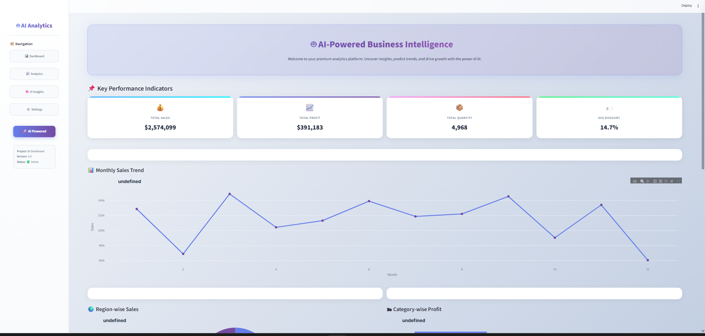

# 🤖 AI-Powered Business Intelligence Dashboard

## 📌 Project Overview

AI-Powered Business Intelligence Dashboard is a Python-based Data Analytics, Business Intelligence, and Machine Learning project developed during my Data Analytics Internship at CodeTech IT Solutions.

The project transforms raw business data into meaningful insights through interactive visualizations, KPI monitoring, automated business intelligence, and AI-driven profit prediction. It helps organizations understand business performance, identify trends, and support data-driven decision-making. 📊🚀

---

## 🎯 Project Objective

The primary objective of this project is to analyze business performance using historical sales data and provide intelligent insights through an interactive dashboard.

The dashboard enables users to:

* Monitor key business metrics.
* Analyze sales and profit trends.
* Identify top-performing regions and categories.
* Detect the impact of discounts on profitability.
* Generate AI-powered business insights.
* Predict future profit using machine learning.

---

## 🚀 Technologies Used

This project leverages modern Data Analytics and Machine Learning technologies, including:

* Python
* Pandas
* NumPy
* Plotly
* Streamlit
* Scikit-Learn
* Joblib
* Jupyter Notebook
* GitHub

---

## 📂 Dataset Information

The project uses a business sales dataset containing the following attributes:

* Order Date
* Sales
* Profit
* Category
* Sub-Category
* Region
* Segment
* Quantity
* Discount

The dataset is used to perform business performance analysis and AI-based profit prediction.

---

## ⚙️ Project Development Process

### Step 1: Data Collection

Imported the business dataset using Pandas and explored its structure for analysis.

### Step 2: Data Cleaning & Preprocessing

Prepared the dataset by:

* Converting date columns.
* Creating Month-based features.
* Validating records.
* Checking data quality.

### Step 3: Business KPI Analysis

Calculated important business metrics, including:

* Total Sales
* Total Profit
* Total Quantity Sold
* Average Discount

### Step 4: Business Intelligence Analysis

Performed detailed analysis to identify:

* Monthly Sales Trends
* Region-wise Performance
* Category-wise Profitability
* Business Growth Patterns

### Step 5: AI-Based Profit Prediction

Implemented a Random Forest Regression model to predict profit based on:

* Sales
* Quantity
* Discount

The trained model was saved using Joblib for dashboard integration.

### Step 6: AI Generated Insights

Generated automated business insights, including:

* Profitability Assessment
* Discount Impact Analysis
* Top Performing Region Identification

### Step 7: Dashboard Development

Developed an interactive dashboard using Streamlit and Plotly featuring:

* KPI Cards
* Interactive Visualizations
* AI Insights
* Profit Prediction Module

### Step 8: Deployment

Successfully deployed the dashboard on Streamlit Cloud and integrated it with GitHub for version control and future enhancements.

---

## ✨ Key Features

* Data Cleaning and Preprocessing
* Business KPI Monitoring
* Monthly Sales Trend Analysis
* Region-wise Sales Analysis
* Category-wise Profit Analysis
* AI-Based Profit Prediction
* Automated Business Insights
* Interactive Dashboard
* Machine Learning Integration
* Live Web Deployment

---

## 🌐 Live Deployment

One of the most important aspects of this project was deploying the dashboard as a live web application using Streamlit Cloud.

The dashboard can be accessed directly through a web browser without requiring any software installation.

### 📋 Deployment Details

* Platform: Streamlit Cloud
* Repository: GitHub
* Deployment Type: Public Web Application
* Status: 🟢 Live & Active

### 🚀 What I Learned During Deployment

* Deploying Streamlit applications.
* Integrating GitHub repositories.
* Managing project dependencies.
* Troubleshooting deployment issues.
* Updating live applications through GitHub.

### ⭐ Why This Is Important

This deployment experience helped me understand how to transform a locally developed analytics project into a publicly accessible business intelligence application.

---

## 🔗 Project Links

🌐 **View Live Dashboard:** *(Add Streamlit Link Here)*

📘 **View Jupyter Notebook:** *(Add Notebook Link Here)*

📂 **View GitHub Repository:** *(Add Repository Link Here)*

---

## 📚 What I Learned

Through this project, I gained practical experience in:

* Data Analytics
* Business Intelligence
* Machine Learning
* Streamlit Dashboard Development
* Interactive Data Visualization
* AI-Driven Decision Support
* GitHub Project Management
* Streamlit Cloud Deployment
* End-to-End Project Development

---

## 🔮 Future Enhancements

Future improvements for this project include:

* Advanced Machine Learning Models
* Real-Time Data Integration
* Executive Summary Generation
* Downloadable Business Reports
* Role-Based Dashboard Access
* Power BI Integration
* Cloud Database Connectivity

---

## 🎓 Project Type

Data Analytics Internship Project (Project 4)

---

## 📌 Project Information

**Prepared By:** Gaurav Kevat

**Intern ID:** CITS34-46

**Course:** B.Tech (Lateral Entry) – CSE (Data Science)

**University:** Jaypee University of Engineering and Technology (JUET), Guna

**Internship Organization:** CodeTech IT Solutions

**Internship Domain:** Data Analytics

**Project Name:** AI-Powered Business Intelligence Dashboard

**Year:** 2026

---

## ⭐ About This Project

This project is my fourth Data Analytics Internship project and demonstrates the practical application of Data Analytics, Business Intelligence, and Machine Learning.

The dashboard converts raw business data into actionable insights through KPI tracking, intelligent visualizations, AI-generated recommendations, and profit prediction.

It showcases how modern analytics solutions can support better business decisions.

---

## ✅ Conclusion

AI-Powered Business Intelligence Dashboard is an end-to-end analytics solution that combines Data Analytics, Business Intelligence, Machine Learning, dashboard development, and deployment.

The project successfully demonstrates how business data can be transformed into meaningful insights, predictive intelligence, and interactive decision-support systems using modern analytical tools and technologies.

---

## 📊 Dashboard Preview

### Main Dashboard

### Business KPI Analysis

### AI Profit Prediction

### AI Generated Insights

